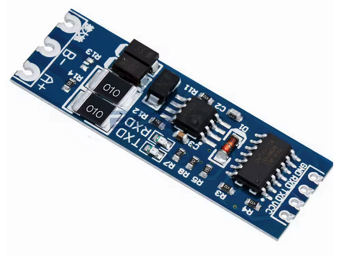

# Drive Pairs of hoverboard motors using Pairs of new driver boards from aliexpress.

 - Buy MM32SPIN05 driver pairs on aliexpress
 - download binary of https://gitlab.com/ailife8881/Hoverboard-Firmware-Hack-Gen2.x-MM32 from discord
 - flash like  https://github.com/RoboDurden/Hoverboard-Firmware-Hack-Gen2.x
 - control like https://github.com/reed-dan/hoverboard_hack_esp32_manualspeed
 - note: slave boards don't have the 15v buck converter, so they need that wired over from master.

## TODO

- [x] pinfinder needs higher voltage to find hall pins
- [x] 48v didn't work... swap out hall cables and double check pinout and try again
      with correct pinout, 24v worked!
- [x] find a suitable led to connect: 3 pin 12, R, G
- [x] complete pin finder and flash main
- [x] motor_control.py spins the motor

- [x] pin find slave board XXX requires 15v power from main board or outside
- [x] load main on slave board
- [x] motor_control.py slave board XXX couldn't do speed 1000 for some reason... also wasn't sounding great
- [x] PA7 current sensor setting did NOT work on master either!
- [x] wire up rp2040 for serial speed control with rs485 adapters... works ok for quite some time, but has crashed
- [x] speed0 sends speed=0 30 times per second over rs485 adapters. slave 2 times out occassionally... good enough
- [x] update speed1.rs with findings from speed0 and then spin the motors!
- [x] run the motor spinning loop from core 1
- [x] add watchdog to main speed sending loop of speed1_core1.rs
- [x] test the RC receiver logging from rp2040 in sbus_pio.rs

- [ ] troubleshoot jerkey speed changes when ramping speed?  try speed1 with minimum steps at different frequencies
      XXX the slave driver board flips out each time a timeout is registered from it!!! XXX


- [ ] add wifi to speed1.rs
- [ ] send fake telemetry to qgroundcontrol from a local python app


- [ ] wire up a second pair of boards and motors!
- [ ] start building the frame!


- [ ] start listing the safety checks rp2040 can do: speed change limits, measure and limit battery current?


- [ ] replace master power button with rp2040 gpio pin ???
- [ ] xt30 power connectors

- [ ] determine if wifi control will be adequate or if the RC protocol is required.
- [ ] decide on running voltage and mosfet cooling requirements


## Flash Razor

Instructions for [Flashing the Razor board](doc/flash-razor.md).


## Flash rp2040

Instructions for [Flashing the Raspberry Pi Pico W](doc/flash-rp2040.md).


## RS485 serial bus




 - serial to rs485 converters running at the default 19200 serial bus speed
 - daisy chain wire topology required
 - short RO jumper to enable 120ohm termination at both ends of the chain
 - probably a separate chain to each sub-assembly
 - contains: https://www.ti.com/lit/ds/symlink/iso7741.pdf
 - and MAX485CSA+  https://www.analog.com/media/en/technical-documentation/data-sheets/max1487-max491.pdf
 - there should not be any protocol changes required. the rs485 chips have auto flow control


## RadioLink TS8 and R8EF:

```
    old channel config read PPM input from RC controller
    ch1  //
    ch2  // steer right
    ch3  // steer left
    ch4  //
    ch5  // engine enable
    ch6  // engine start
    ch7  // enable steering
    ch8  //
```

## Old Mower Layout

```
  Track Module:
   - large battery
   - 2 motors
   - 2 drivers
   - battery voltage sensor?? or accurate reading from board??
   - acs758 battery current sensor ??
   - single aviation connector

  20v battery for engine and control modules

  Control module:
   - 5v buck converter
   - raspberry pi pico W
   - 3x rs485 to serial adapters (left, right, engine)
   - RadioLink R8EF
   - level shift module for engine relays

  Engine Module:
   - 12v buck for relay coils
   - small relays:
     start: 5v switches 12v big relay coil on
     enable: 5v switches off spark plug ground wire (that normally stops the engine)
   - big relay: 20v engine start
   - flyback diode (stripe +) across big relay coil


  Mower Run Procedure:
  - attach all batteries
  - power on remote
  - enable controlls with red switch on mower??
  - steer mower: ch2, ch3
  - set deck height: roll ch8 to desired height?
  - enable engine start
  - hold starter till engine starts, then release
  - leave engine on, but lock starter
  - mow
  - bumper stops engine and wheels and waits for a change to ???
  - stop engine: ch5 = down
    skid steer and set deck height
  - disable controlls with red switch on mower
  - power off remote
  - remove batteries
```


## Notes to my future self in chronological order

* you wanted to make an RC lawnmower
* you wanted cheap motors with enough torque to move the mower up steep hills
* youtube thinks there are many unwanted hoverboards floating around
* you bought a bunch of hoverboards and ripped them apart
* you made piles of hoverboard connectors, boards, and motors
* you assumed you would want to buy new speed controllers for each motor
* you tried 6 different, cheap, speed controllers
* the only one that had a chance of working well was the $25 BLD-510B
* you liked using modbus RTU to talk to the BLD-510B...
  but then gave up when you could not figure out how to actually
  throttle the motor by setting speed values with modbus RTU
* if this all fails, go back and feed PWM and direction to the BLD-510B
  and save the modbus RTU for initial configuration only
* you still had piles of free boards sitting around, so you decided
  to start trying hoverboard hack firmware
* you bought a bunch of example MCU boards, serial interfaces, stlink interfaces
  and all the other junk you would need to try to put new firmware
  on hoverboard pcb
* you found https://github.com/RoboDurden/Hoverboard-Firmware-Hack-Gen2.x
  and started working through the process of identifying and flashing boards
* you burned some boards and stlink v2 (maybe.. they might still be good, not sure)
* you then decided to order some known-good hoverboard pcb from aliexpress
* now you had new firmware on one hoverboard pcb, but not yet control from another mcu
* Now you can't remember why, but for some reason you abandoned the serial control interface
  and decided to try rebuilding the whole MM32 project in rust.
* then after a month or so, you decided that wouldn't work
* so now you're back working on the serial interface to the pre-built binary
* pin finder worked well so you bought a bunch of the connectors needed to make flashing and using the boards easier
* testing continues...


