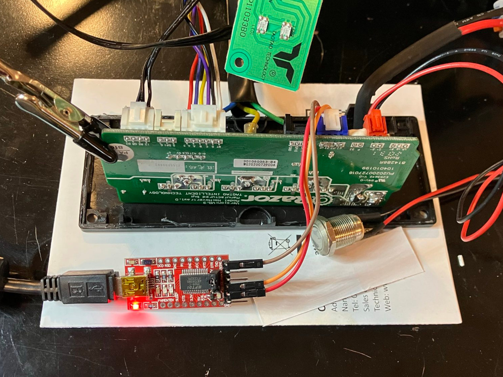

# Drive hoverboard motors using new driver boards from aliexpress.

 - Buy MM32SPIN05 driver pairs on aliexpress
 - download binary of https://gitlab.com/ailife8881/Hoverboard-Firmware-Hack-Gen2.x-MM32 from discord
 - flash like  https://github.com/RoboDurden/Hoverboard-Firmware-Hack-Gen2.x
 - control like https://github.com/reed-dan/hoverboard_hack_esp32_manualspeed

## TODO

- [x] pinfinder needs higher voltage to find hall pins
- [x] 48v didn't work... swap out hall cables and double check pinout and try again
      with correct pinout, 24v worked!
- [x] find a suitable led to connect: 3 pin 12, R, G
- [ ] complete pin finder and flash main
- [ ] motor_control.py spins the motor

- [ ] speed1.rs spins the motor
- [ ] flash and run pinfinder on the slave. motor_control.py on slave. speed1.rs on slave
- [ ] speed1.rs over rs485 bridge at 19200
- [ ] get 2 boards with motors all talking over rs485 taking speed commands from rp2040
- [ ] get 4 boards with motors all talking over rs485 taking speed commands from rp2040

- [ ] disable master power button and deal with latch????
- [ ] xt30 power connectors
- [ ] test RC
- [ ] determine if wifi control will be adequate or if the RC protocol is required.
- [ ] decide on running voltage and mosfet cooling requirements

## Flash Razor

Instructions for [Flashing the Razor board](doc/flash-razor.md).

## Flash rp2040

how to flash this project onto rp2040 for controlling many hoverboard motors

## RS485 serial bus
 - serial to rs485 converters running at the default 19200 serial bus speed
 - daisy chain wire topology required
 - short RO jumper to enable 120ohm termination at both ends of the chain
 - probably a separate chain to each sub-assembly
 - contains: https://www.ti.com/lit/ds/symlink/iso7741.pdf
 - and MAX485CSA+  https://www.analog.com/media/en/technical-documentation/data-sheets/max1487-max491.pdf
 - there should not be any protocol changes required. the rs485 chips have auto flow control

## Notes to my future self in chronological order

* you wanted to make an RC lawnmower
* you wanted cheap motors with enough torque to move the mower up steep hills
* youtube thinks there are many unwanted hoverboards floating around
* you bought a bunch of hoverboards and ripped them apart
* you made piles of hoverboard connectors, boards, and motors
* you assumed you would want to buy new speed controllers for each motor
* you tried 6 different, cheap, speed controllers
* the only one that had a chance of working well was the $25 BLD-510B
* you liked using modbus RTU to talk to the BLD-510B...
  but then gave up when you could not figure out how to actually
  throttle the motor by setting speed values with modbus RTU
* if this all fails, go back and feed PWM and direction to the BLD-510B
  and save the modbus RTU for initial configuration only
* you still had piles of free boards sitting around, so you decided
  to start trying hoverboard hack firmware
* you bought a bunch of example MCU boards, serial interfaces, stlink interfaces
  and all the other junk you would need to try to put new firmware
  on hoverboard pcb
* you found https://github.com/RoboDurden/Hoverboard-Firmware-Hack-Gen2.x
  and started working through the process of identifying and flashing boards
* you burned some boards and stlink v2 (maybe.. they might still be good, not sure)
* you then decided to order some known-good hoverboard pcb from aliexpress
* now you had new firmware on one hoverboard pcb, but not yet control from another mcu
* Now you can't remember why, but for some reason you abandoned the serial control interface
  and decided to try rebuilding the whole MM32 project in rust.
* then after a month or so, you decided that wouldn't work
* so now you're back working on the serial interface to the pre-built binary

